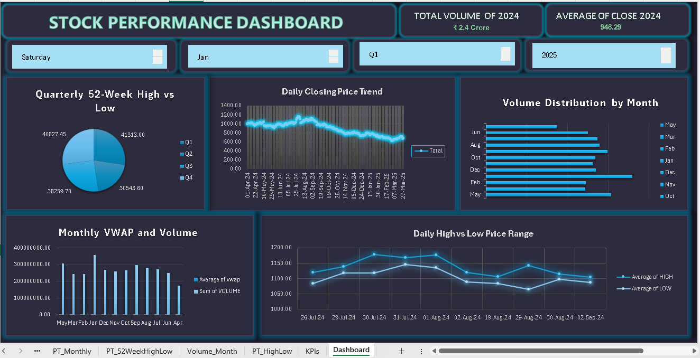

# 📈 Stock Market Analysis – Excel Project

*Description:* Analyze stock data with interactive dashboards and KPIs to understand price trends, volume, and 52-week performance.

---

## *Table of Contents*
- [Project Objectives](#project-objectives)
- [Key Questions](#key-questions)
- [Dataset](#dataset)
- [Process](#process)
- [Dashboard Screenshots](#dashboard-screenshots)
- [Charts & Insights](#charts--insights)
- [Conclusion](#conclusion)
- [Future Enhancements](#future-enhancements)

---

## Project Objectives
- Analyze stock data using Excel
- Build KPIs for stock performance
- Create charts for price, volume, and 52-week comparisons
- Design an interactive dashboard with pivot tables and slicers

## Key Questions
- Daily stock price movements
- Months with highest and lowest trading volumes
- Stock position relative to 52-week high and low
- Monthly VWAP variations
- Daily high-low price range

## Dataset
- Columns: Date, Open, Close, High, Low, Volume, VWAP, 52-week High, 52-week Low

## Process
- Verified data for missing values and inconsistencies
- Ensured consistent data types and formats
- Created pivot tables for price trends, volume, VWAP, 52-week range
- Built KPIs using pivot outputs
- Combined charts and KPIs into an interactive dashboard
- Added slicers for dynamic filtering

## Dashboard Screenshots
- 

## Charts & Insights
- *Pie Chart – Quarterly 52-Week High vs Low:* Distribution of 52-week high/low across quarters
- *Line Chart – Daily Closing Price Trend:* Shows daily price movement and trend
- *Bar Chart – Volume Distribution by Month:* Highlights high/low volume months
- *Column Chart – Monthly VWAP and Volume:* Compares average VWAP with monthly volume
- *Line Chart – Daily High vs Low Price Range:* Displays daily price volatility

## Conclusion
- Provides clear view of stock trends, trading activity, and yearly performance
- Helps make informed decisions

## Future Enhancements
- Add moving averages (5-day, 20-day, 50-day)
- Include trend strength indicators (RSI/MACD)
- Automate data refresh using Power Query
- Alerts for price crossing VWAP or 52-week levels
- Advanced Power BI version of the dashboard
